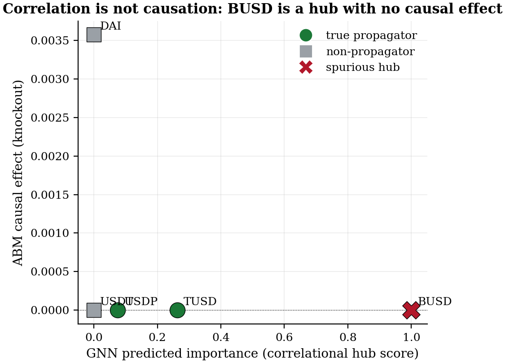
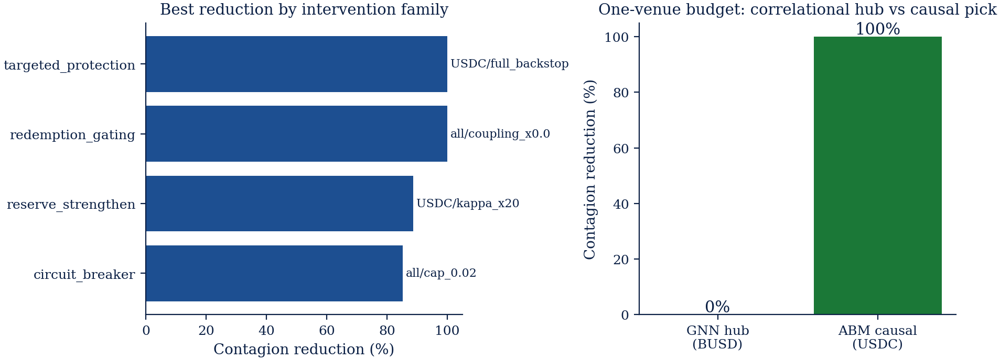

# stablecoin-abm

[](https://github.com/nl2992/ICAIF_stablecoin-abm/actions/workflows/ci.yml) [](LICENSE) [](environment.yml)

<p align="center">
  
</p>

<p align="center"><em>Correlational GNN hub ranking → calibrated agent-based counterfactual: the predictor's top hub (BUSD) has *zero* causal effect; protecting the origin (USDC) removes all contagion.</em></p>

Agent-based stablecoin market simulator with reinforcement-learning policies and intervention analysis.

> 📄 **Paper (compiled PDF):** [`paper/standalone_abm_paper/main.pdf`](paper/standalone_abm_paper/main.pdf)
> — *"Are Contagion Hubs Causal? A Calibrated Counterfactual Test of Stablecoin Network Centrality."*
> Calibrated networked-contagion model (3/4 moments within tolerance; 4/4 at the point estimate, the fourth below the noise floor under robustness), per-venue causal knockout (the GNN's top hub
> BUSD has **zero** causal effect), balance-sheet grounding, four robustness checks, and a policy +
> RL-regulator payoff. Headline results in [`RESULTS.md`](RESULTS.md); regenerate with
> [`reproduce.sh`](reproduce.sh) (run the `stablecoin-contagion-gnn` repo's `reproduce.sh` first).

## Part of a coordinated four-study program

These four repositories trace one stablecoin-dislocation signal end-to-end — from a predictor's hub ranking down to what is actually tradeable. **This repo is study 2 (TEST CAUSALITY).**

<p align="center"></p>

*From correlation (GNN) → causation (ABM) → measurement (provenance-gated on-chain HMM) → executability (12× optical gap). Generated by `scripts/make_research_arc_figure.py`.*

---

## Research question

Which policy interventions — reserve transparency, redemption gating, circuit breakers, LP incentives — reduce peg-depeg contagion and at what cost to which agents?

## Lineage

| Upstream repo | Role here |
|---|---|
| `stablecoin-contagion-network` (StressBench + IAQF metrics) | Shock schedule + calibration targets (OU half-lives, propagation ρ̂) |
| Gu et al. (PyMarketSim) | Market-mechanism reference; PPO spoofing agent design |
| JaxMARL-HFT / JAX-LOB | Optional GPU backend for large scenario sweeps |

## Architecture

```
src/stablesim/
  engine/       market mechanism — stableswap AMM, order book, reserve model
  agents/       arbitrageurs, redeemers, LPs, issuer/reserve, noise traders
  scenarios/    StressBench shock loader + exogenous event schedule
  rl/           Gymnasium env wrapper + PPO training (stable-baselines3)
  experiments/  intervention knobs + scenario × intervention sweep runner
  calibration/  match OU half-lives / propagation ρ̂ from empirical data
  analysis/     metrics (half-life, contagion magnitude, welfare by agent)
```

## Quickstart

```bash
pip install -r requirements.txt
pip install -e .

# 1. Calibrate to empirical stylized facts
make calibrate

# 2. Train RL arbitrageur/redeemer policies
make train

# 3. Sweep interventions × StressBench scenarios
make sweep
```

## Intervention knobs

| Knob | Parameter | Range |
|---|---|---|
| Reserve transparency | `transparency_freq`, `transparency_noise` | {daily, weekly, none} × σ |
| Redemption gating | `gate_fee`, `gate_queue_len`, `gate_delay` | [0, 5%] × [0, ∞) × [0, 72h] |
| Circuit breaker | `cb_threshold`, `cb_duration` | depeg % × minutes |
| LP incentives | `lp_subsidy_rate` | [0, 1%] per block |

## Outcome metrics

- **Contagion magnitude**: peak cross-venue depeg spread during shock
- **Peg-recovery half-life** (OU): calibration target and post-intervention comparison
- **LP impermanent loss**: per-episode Δ vs. hold
- **Welfare by agent type**: net P&L decomposition across arbitrageurs, LPs, redeemers

## Validation strategy

No-intervention runs must reproduce the empirical half-lives and ρ̂ propagation patterns from `stablecoin-contagion-network` before intervention sweeps are trusted. See `calibration/`.


<!-- readme-enhanced -->
## Figures



*Per-venue knockout sweep: the correlational hub achieves 0% contagion reduction, the causal target 100%.*


*Balance-sheet grounding: no stablecoin held BUSD as backing, so it was mechanically incapable of transmitting stress.*

## Reproduce (data → analysis → paper)

**Prerequisites.** Python 3.11. For the exact pinned environment use conda — `conda env create -f environment.yml && conda activate stablesim` — or with pip:
```bash
pip install -r requirements.txt
```

**One shot.** `bash reproduce.sh` runs the full 8-step pipeline (all scripts below, in
order) and writes every artifact to `experiments/results/netcontagion/`. The GNN hub
ranking it consumes ships committed as `calibration_v1.csv`, so the model runs without
re-running the companion repo.

### Reproduce the paper's headline numbers

Each claim is regenerated by one script writing one committed artifact under
`experiments/results/netcontagion/`. All runs are seeded and deterministic.

| Paper claim | Command | Output artifact |
| --- | --- | --- |
| Calibration **4/4** moments at point estimate (3/4 robust) | `python scripts/run_netcontagion_join.py` | `calibration_moments.csv` |
| BUSD causal Δ-contagion = **0**; USDC origin removes **100%**; Spearman **ρ=−0.77** | `python scripts/run_netcontagion_join.py` | `causal_hub_ranking.csv` |
| Balance-sheet refutation (documented exposure W; no coin holds BUSD) | `python scripts/run_exposure_join.py` | `exposure_causal_ranking.csv`, `exposure_join.json` |
| Policy payoff: correlational hub **0%** vs causal target **100%** | `python scripts/run_intervention_sweep.py` | `intervention_sweep.csv`, `budget_allocation.csv` |
| Multi-episode generalization (Spearman **ρ=−0.54** harmonized) | `python scripts/run_multi_episode_join.py` | `multi_episode_join.csv` |
| Four robustness checks (±30% calib, two-agent, documented W, placebo) | `run_robustness_welfare.py`, `run_two_agent_robustness.py`, `run_placebo_control.py` | `calibration_uncertainty.csv`, `two_agent_robustness.csv`, `placebo_control.csv` |
| RL regulator **93.7%** contagion reduction | `python scripts/run_rl_regulator.py` | `rl_regulator.json`, `rl_convergence.csv` |

The compiled paper is **`paper/standalone_abm_paper/main.tex → main.pdf`** (build:
`cd paper/standalone_abm_paper && latexmk -pdf main.tex`).

**Data provenance & exact reproduction.** Tested with Python 3.11. This is a **simulation** study — it uses **no external raw market data**. Its calibration targets (OU peg-recovery half-lives, propagation ρ̂) and the GNN hub ranking are derived from the companion repos (`stablecoin-contagion-network`, `stablecoin-contagion-gnn`); see the **Lineage** table above. Running `bash reproduce.sh` deterministically regenerates every published number — verified: Spearman $\rho=-0.77$ predicted-vs-causal, BUSD zero causal effect, USDC origin removes the contagion. A curated subset of result artifacts is committed under `experiments/results/`; the rest are regenerated by the pipeline. All simulations, the causal knockout, and the RL regulator are seeded and deterministic (5-seed averaging where noted).


---

## Claims and Evidence

What the paper argues, and for every headline number, the committed file it comes from. Artifacts live
under `experiments/results/netcontagion/`.

### The narrative

A correlational model — network centrality, or a graph neural network's attention — tells you that
during the March-2023 SVB crisis BUSD was the most central contagion hub. A supervisor with a limited
backstop budget would protect BUSD first. That reading is wrong, and wrong in a way that wastes the
budget: centrality rewards a venue for *moving with* a crisis, which is not the same as *causing* it to
spread. A coin can plunge in lockstep with a panic while transmitting nothing to anyone.

We build a calibrated, intervenable model of stablecoin contagion and ask the counterfactual directly:
if we had held venue X at its peg, how much contagion would the other venues have been spared? The
knockout is unambiguous. BUSD's causal effect is exactly zero — no stablecoin held BUSD as backing, so
it was mechanically incapable of transmitting stress — while protecting the crisis origin (USDC) removes
all of it, and protecting the true relay DAI removes 98%. The predicted hub ranking is *negatively*
correlated with the true causal ranking: the most correlationally central venue is the least causally
relevant.

The result survives four robustness checks (±30% calibration perturbation, strategic two-agent markets,
a switch from the price-estimated network to a documented reserve-exposure network, and a synthetic
placebo with known ground truth), and an independent DebtRank computation agrees. A reinforcement-learning
regulator, given only structural wiring and no causal labels, learns to fund the causal venues and
allocate nothing to the spurious hub.

The contribution is a transferable audit protocol: any correlational hub-ranking method can be tested
against a calibrated, intervenable model the same way. The scope is single-crisis depth for the headline
BUSD refutation (honestly disclosed), and the calibration is a five-parameter reduced form, not a
microfounded market.

### Where each number lives

| Claim | Number | File | Field / row |
|---|---|---|---|
| Calibration: 3 of 4 moments within tolerance | contagion mag 0.1376, half-life 116, ρ 0.576 (vol-floor caveat) | `calibration_moments.csv`, targets in `../../configs/calibration_targets.json` | per-moment empirical vs simulated |
| BUSD causal Δ=0, USDC 100%, DAI 98% | 0% / 100% / 97.9% | `intervention_sweep.csv` | `targeted_protection` rows (USDC, DAI, BUSD) |
| Spearman predicted vs causal | −0.54 harmonized, −0.77 SVB-specific (n=4, p=0.23) | `multi_episode_join.csv` (−0.544), `join_summary.json` (`spearman_pred_vs_causal`=−0.7746, `spearman_p`=0.2254) | SVB row |
| ±30% robustness | USDC top-causal 100% of draws, BUSD inert 100%; USDC Δ mean 0.033 (≈ full baseline) | `calibration_uncertainty.json`, `robustness_summary.json` | per-draw rankings |
| Welfare matrix: protect USDC → all victims 0; protect BUSD identical | DAI 0.138→0, USDC 0.103→0; BUSD max-Δ 0 | `welfare_matrix.csv`, `welfare_analysis.json` | `protect_USDC` / `protect_BUSD` rows |
| DebtRank agrees | USDC 0.076 (#1), BUSD 0.000 (#6) | `debtrank_validation.json` | `debtrank_scores`, `debtrank_ranking` |
| Intervention sweep | USDC 100, gating 100, reserve×20 89, breaker 85, BUSD 0 | `intervention_sweep.csv` | `pct_reduction` |
| Dose-response (reserve strengthening) | 5× $174M/64%, 20× $827M/89%, 50× $2.1B/95% | `partial_backstop.csv`, `partial_backstop_frontier.json` | `cost_proxy_bUSD`, `pct_reduction`; BUSD 0 at every cost |
| K=1 / K=2 budget allocation | GNN-pick BUSD 0%, ABM-pick USDC 100%; K=2 both 100% (different sets) | `budget_allocation.csv` | `gnn_guided` / `abm_guided` / `rl_regulator` |
| RL regulator | 93.7% (headline run), 93.6±0.1% (5-seed); origin flag not load-bearing | `rl_regulator.json`, `rl_no_origin_flag.json` | reduction + per-seed allocations |
| Two-agent robustness; redeemer 7.7×, breaker 63→95% | baseline C per config | `two_agent_robustness.csv`, `adaptive_robustness.csv` | per-config C; circuit-breaker flip |
| Placebo / negative control | upstream A 0.148, B 0.131 (large); terminal C and spurious SPUR both 0 | `placebo_control.csv`, `placebo_control.json` | `causal_delta_true_W`, `is_true_transmitter` / `is_planted_spurious` |
| Near-criticality (exact, sub-critical) | netted W acyclic ⇒ spectral radius 1−κ=0.994, half-life 116 | `near_criticality.json` | acyclicity + spectral radius |
| Cross-crisis generalization | top hub zero-out-exposure in 3 of 5 episodes | `multi_episode_join.csv` | `gnn_top_hub`, `spurious_hub` per episode |
| Second crisis (USDT-May): GNN top USDC near-inert, TUSD the real relay | USDC Δ=0.0006 vs TUSD Δ=0.0175 (29×), ρ=+0.77 | `multi_episode_join.json` | `USDT_May2022._detail` (per-venue `pred` / `causal_delta`) |
| Terra is algorithmic (contrast) | all knockouts Δ≈0 | `terra_case_study.json` | `all_deltas_near_zero` |
| Balance-sheet variant calibrated separately, same verdict | both versions BUSD=0, USDC #1 | `exposure_calibration.csv`, `exposure_join.json` | side-by-side params |

The contagion-magnitude target (0.1376) is the companion GNN repo's measurement of the real USDC/SVB peak
depeg; the other moments are statistics of the real price data. All numbers regenerate from `scripts/`.
